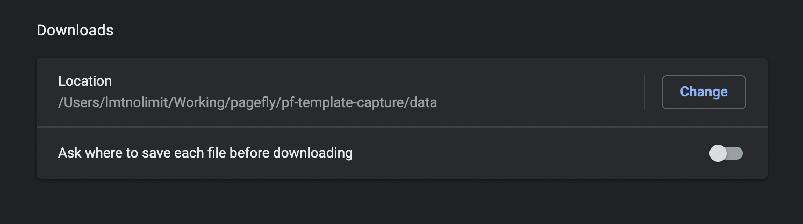

# **PageFly templates tools**

## **Install**
- install node_modules
```
cd templates
yarn install
```
- create a config file from example config file
```
cp config.example.js config.js
```

## **Usage** (Step by step)
You have to run the tool from `templates` directory:
```
cd templates
```
### **Download templates data** (deprecated)
1. Update browser settings:
- Change location
- Disable "Ask where to save each file before downloading"
 

2. Login this Shopify store: https://partners.shopify.com/589565/stores/21701117

3. Open PageFly app from app listing

4. Quit browser and run Google Chrome in debugging mode:
- On MacOS:
```
/Applications/Google\ Chrome.app/Contents/MacOS/Google\ Chrome --remote-debugging-port=9222
```
- On Windows:
```
Coming soon
```

5. Go to this link http://127.0.0.1:9222/json/version and check for the `webSocketDebuggerUrl`, copy the value of it

6. Replace the `wsChromeEndpointUrl` variable on the `config.js` file

7. Update templates handle on the file `constant.js`

8. Run `yarn start` and select the option `Download Templates Data`.

9. Wait until its done


### **Download templates thumbnails**
1. Run `yarn start` and select the option **Download Templates Thumbnail**.

2. If take screenshot and optimize all templates, just ignore the first question, type `y` on the second one

3. If take screenshot and optimzie for only some templates, type in the template name which can be found on the demo page <br>
For example: `https://demo.pagefly.io/pages/digisnap` the template name is `digisnap`. Each templates seperate with a comma and no space on it

4. While running if it stop and return errors, the tinify key might reach the limit usage, please change the key on the file configs `config.js` 

### **Download templates HTML**
1. Run `yarn start` and select the option **Download Templates HTML**.

2. Wait until its done

3. Check for the **html** directory

### **Minify html**
1. Run `yarn start` and select the option `Minify HTML`.

2. Wait until its done